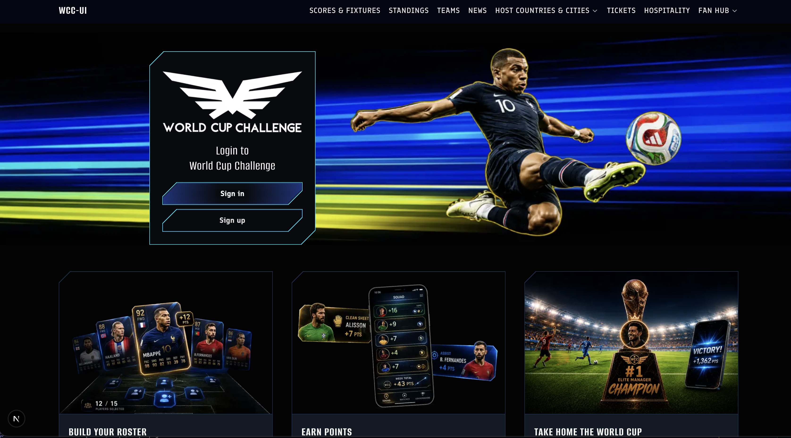

# World Cup UI

Work in progress: Portfolio UI for international soccer fantasy game



## Currently Available

- **Landing Page and Login**: final and responsive

## Under Construction
 
 - **Dashboard / Roster**: dashboard home plus `/roster` for squad selection (same app shell; roster embeds the selection UI).

## Stack

- [Next.js](https://nextjs.org/) 16 (App Router)
- [React](https://react.dev/) 19
- [TypeScript](https://www.typescriptlang.org/)
- [Sass](https://sass-lang.com/) (CSS Modules + shared WCUI design tokens)
- [Firebase](https://firebase.google.com/) (client SDK: Auth + Firestore)

## Quick start

**Requirements:** Node.js 20+ and npm, and a [Firebase](https://console.firebase.google.com/) project with **Email/Password** sign-in and **Cloud Firestore** enabled.

1. **Clone the repository**

   ```bash
   git clone https://github.com/SneauxGirl/world-cup-ui
   cd wordcup-ui
   ```

2. **Install dependencies**

   ```bash
   npm install
   ```

3. **Configure Firebase**

   In the Firebase console, add a **Web app** to your project and copy its config. Create `.env.local` in the project root (gitignored) with:

   ```bash
   NEXT_PUBLIC_FIREBASE_API_KEY=
   NEXT_PUBLIC_FIREBASE_AUTH_DOMAIN=
   NEXT_PUBLIC_FIREBASE_PROJECT_ID=
   NEXT_PUBLIC_FIREBASE_STORAGE_BUCKET=
   NEXT_PUBLIC_FIREBASE_MESSAGING_SENDER_ID=
   NEXT_PUBLIC_FIREBASE_APP_ID=
   ```

   Values map to `lib/firebase/client.ts`. Restart `npm run dev` after changing env vars.

4. **Run the development server**

   ```bash
   npm run dev
   ```

5. **Open the app** at [http://localhost:3000](http://localhost:3000). The home page renders the Landing page. Sign-in and sign-up use email/password via `AuthProvider` (`components/auth/AuthProvider.tsx`); new accounts also write a `users/{uid}` document in Firestore.

## Dummy player data

Fantasy stats and game logs live in `data/fantasy_dummy_data_expanded_filled.csv` and are compiled into `data/player-fantasy-profiles.json` for the app.

To regenerate profiles after CSV edits:

```bash
node scripts/build-player-profiles.mjs
```

`npm run build` runs this script automatically before the Next.js build.


## License

[MIT](./LICENSE.md) — Copyright (c) 2026 Heather Hugo
