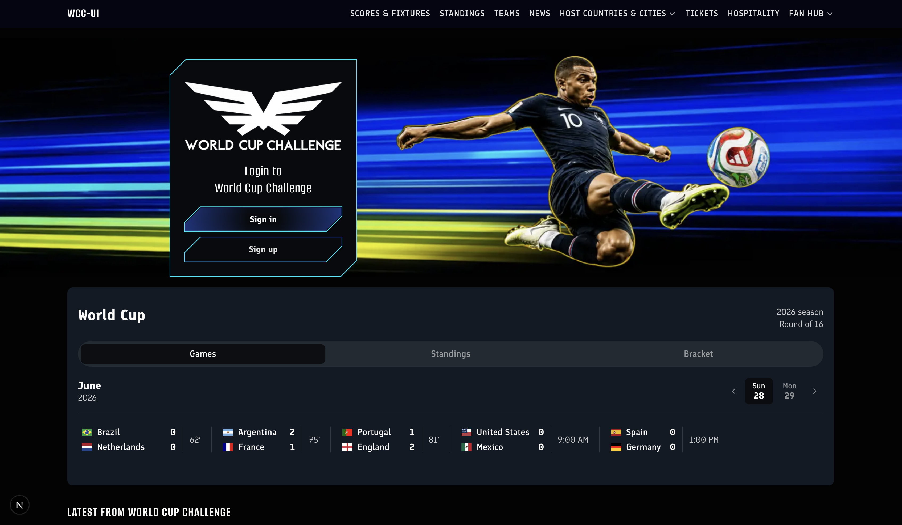

# World Cup UI

Work in progress: Portfolio UI for international soccer fantasy game



## Currently Available

- **Landing Page and Login**: final and responsive

## Under Construction
 
 - **Dashboard**: disconnected for refactor

## Stack

- [Next.js](https://nextjs.org/) 16 (App Router)
- [React](https://react.dev/) 19
- [TypeScript](https://www.typescriptlang.org/)
- [Sass](https://sass-lang.com/) (CSS Modules + shared WCUI design tokens)

## Quick start

**Requirements:** Node.js 20+ and npm.

1. **Clone the repository**

   ```bash
   git clone https://github.com/SneauxGirl/world-cup-ui
   cd wordcup-ui
   ```

2. **Install dependencies**

   ```bash
   npm install
   ```

3. **Run the development server**

   ```bash
   npm run dev
   ```

4. **Open the app** at [http://localhost:3000](http://localhost:3000). The home page renders the Landing page.

5. **Re-enable sign-in** → dashboard: Remove onSubmit={(event) => event.preventDefault()} from components/auth/LoginForm.tsx


## License

[MIT](./LICENSE.md) — Copyright (c) 2026 Heather Hugo
